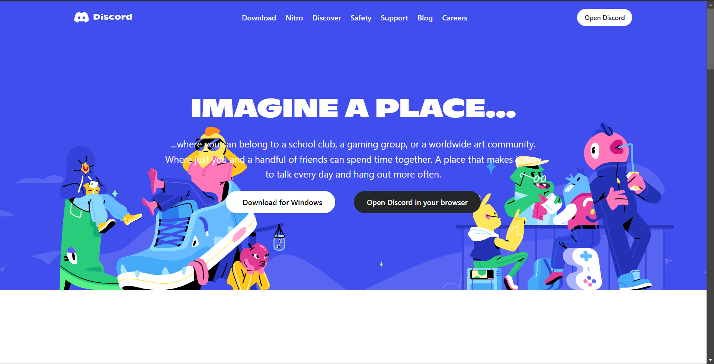

# Discord Clone

This project is a **Discord Clone** built using **HTML** and **Tailwind CSS**. It aims to replicate the modern, sleek UI of Discord's web application while providing a responsive and interactive user interface.

---


## Screenshots

### Home Page


### Features Page


## Features

- **Modern UI Design**: Replicates the aesthetic and layout of Discord.
- **Responsive Layout**: Adapts seamlessly to different screen sizes, ensuring a smooth user experience on both desktop and mobile devices.
- **Custom Styling**: Utilizes Tailwind CSS for easy and efficient styling.

---

## Installation and Setup

Follow these steps to set up the project on your local machine:

### 1. Clone the Repository
```bash
git clone https://github.com/VickyMourya/Discord.git
cd Discord
### 2. Install Dependencies
```bash
Install Node.js dependencies: npm install
### 2. Start the Project
```bash
Install Node.js dependencies: npm install
### 2. Install Dependencies
```bash
Build the CSS using Tailwind: npm run build


## Node Modules

**The node_modules directory contains the dependencies required for Tailwind CSS to work. Key dependencies include:

- **PostCSS: A tool for transforming CSS.
- **Autoprefixer: Adds vendor prefixes for cross-browser compatibility.
- **Custom Styling**: Tailwind CSS: The core framework for styling


## Folder Structure

- **Discord/
├── index.html        # Main HTML file
├── style.css         # Compiled Tailwind CSS file
├── tailwind.config.js # Tailwind configuration
├── package.json      # Project metadata and dependencies
├── postcss.config.js # PostCSS configuration
└── node_modules/     # Dependencies (ignored in Git)


